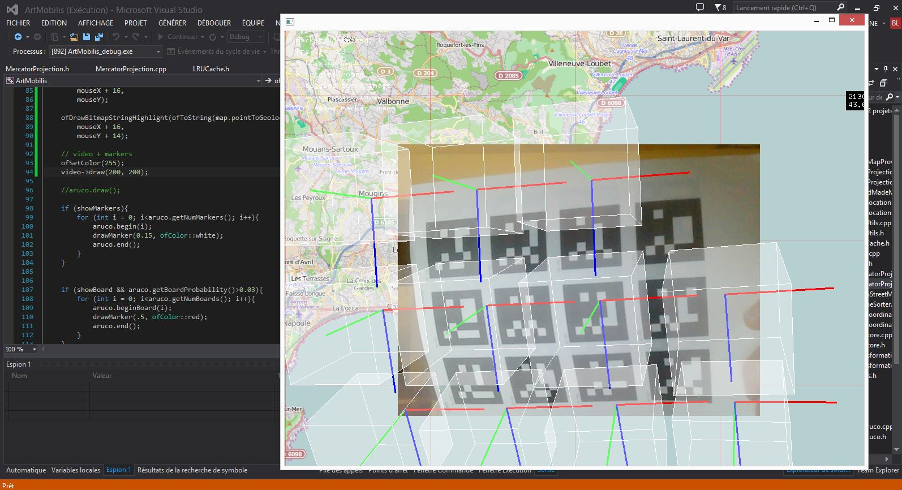

# Art Mobilis - Prototypes applications

Projet Art Mobilis de parcours culturel au sein de territoires.

Développé collaborativement par plusieurs développeurs, graphistes et artistes.

Dossier application openFrameworks (C++).

Nécessite les ofxAddons (à mettre dans le dossier addons de openFrameworks):
 - https://github.com/brucelane/ofxAruco ( modifié pour éviter run-time error décrite ici: https://github.com/arturoc/ofxAruco/issues/3 )
 - https://github.com/kylemcdonald/ofxCv branch develop
 - https://github.com/labatrockwell/ofxLibwebsockets
 - https://github.com/YCAMInterlab/ofxTimeline
 - https://github.com/YCAMInterlab/ofxTimecode
 - https://github.com/arturoc/ofxTween.git
 - https://github.com/obviousjim/ofxMSATimer
 - (inutile?) https://github.com/Flightphase/ofxTextInputField (j'ai commenté les lignes 341 et 346-351 du .cpp TODO: #define)
 - https://github.com/bakercp/ofxMaps branch develop
 - https://github.com/bakercp/ofxGeo  ( ajouter const double M_PI = 3.14159265358979323846; et const double M_PI_2 = 6.283185307179586476925286766559; dans GeoUtils.cpp ) 
- https://github.com/bakercp/ofxHTTP branch develop
- https://github.com/bakercp/ofxIO branch develop
- https://github.com/bakercp/ofxMediaType branch develop
- https://github.com/bakercp/ofxNetworkUtils branch develop
- https://github.com/bakercp/ofxSSLManager
- https://github.com/bakercp/ofxTaskQueue branch develop
- 

Imprimer les marqueurs du dossier bin/data: board.png et/ou boardImage.png

Sous Linux:

Sous Windows:

